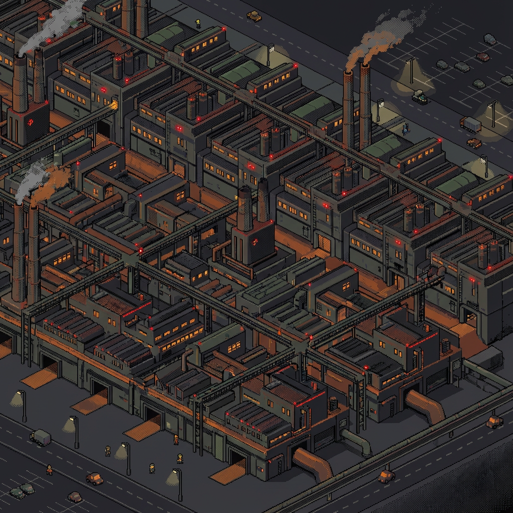
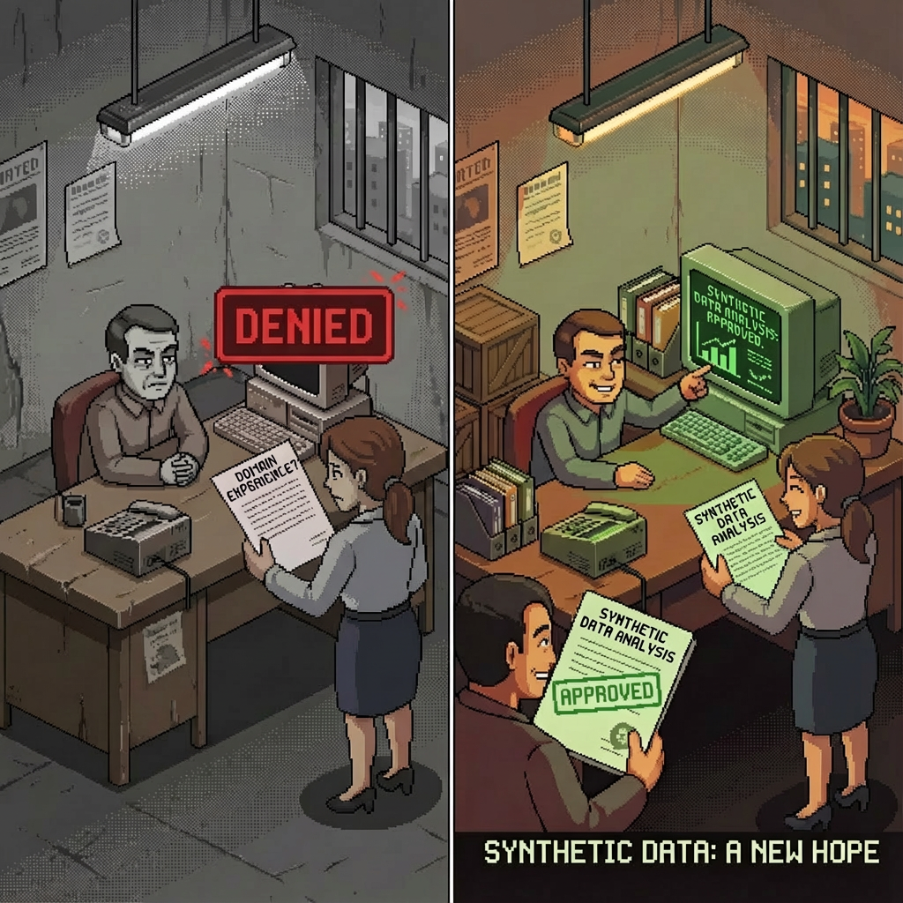

# Gigafactory Battery Production Process Mining

[](https://www.python.org/)
[](LICENSE)
[](https://github.com/mammykins/giga-factory/stargazers)
[](https://github.com/mammykins/giga-factory/commits/main)
[](https://github.com/mammykins/giga-factory)
[](https://deepwiki.com/badge-maker?url=https%3A%2F%2Fdeepwiki.com%2Fmammykins%2Fgiga-factory)



This project provides a framework for analysing and understanding the production process of a gigafactory that manufactures a product at scale (e.g. batteries). It combines **LLM-powered synthetic data generation** with **process mining techniques** to identify bottlenecks, rework loops, correlations, and potential areas for optimisation.

The project features two data generation approaches:
- **Enhanced LLM-based generator** (`gigafactory_data_designer.py`) - Uses NVIDIA NeMo Data Designer to create professionally engineered datasets with correlated variables, batch traceability, and physics-aware quality metrics
- **Traditional rule-based generator** (`battery_production_miner.py`) - Generates event logs with predefined rework patterns for process mining analysis

---

## Who Is This For?

This project is intended for:

- **Data scientists** exploring process mining methods with synthetic data.
- **Manufacturing engineers** who want to experiment with analysis techniques before applying them to real gigafactory data.
- **Students and researchers** learning about process discovery and event log analysis.

---

## Usage Scenarios

- **Demo Mode (Synthetic Data):**
  Run the included scripts to generate a synthetic event log and perform process mining analysis. This is useful for learning and experimentation.
- **Real Data Mode:**
  Replace the synthetic CSV with actual production event data (see *Next Steps for Real-World Application*).

---

## Core Features

### 1. Enhanced LLM-Based Data Generation



Generate professionally engineered datasets using NVIDIA NeMo Data Designer with:
- **Correlated Variables**: Simulate "bad shift" scenarios where Friday PM + Coating Room triggers +5°C temperature anomalies
- **Batch Traceability**: Track individual batches through 5 sequential manufacturing steps (Slurry Mixing → Coating & Drying → Calendering → Winding/Stacking → Final Grading)
- **Physics-Aware Metrics**: Context-specific quality measurements (Viscosity for mixing, Electrode Thickness for coating, Internal Resistance for final grading)
- **Polymorphic Schema**: Dynamically selects appropriate metrics based on manufacturing step
- **Narrative Logs**: LLM-generated operator notes that reference actual data values and shift conditions

### 2. Process Mining & Analysis
- **Process Discovery:** Uses the `pm4py` library to discover process models (Petri Nets) from event logs
- **Bottleneck Analysis:** Identify longest-duration activities
- **Rework Detection:** Track quality failures and reprocessing loops
- **Conformance Checking:** Validate fitness and precision of discovered models
- **Correlation Analysis:** Detect relationships between shift timing, location, temperature, and quality outcomes

### 3. Validation Framework
- Automated testing of temperature correlations
- Batch traceability verification (95%+ success rate)
- Process step progression validation

---

## Technologies Used

- **Python 3.13** – core programming language
- **NVIDIA NeMo Data Designer** – LLM-powered synthetic data generation
- **Pandas / NumPy** – data handling and analysis
- **PM4Py** – process mining algorithms and visualization
- **Matplotlib / Graphviz** – process model visualization
- **Pydantic** – schema validation and type safety

---

## Setup and Installation

1. **Clone the repository** (or download the files):

   ```bash
   git clone https://github.com/your-username/gigafactory-process-mining.git
   cd gigafactory-process-mining
   ```

2. **Install uv** (if not already installed):

   ```bash
   # macOS/Linux
   brew install uv
   
   # Or using pip
   pip install uv
   ```

3. **Install dependencies:**

   ```bash
   # uv automatically creates and manages the virtual environment
   uv sync
   ```

4. **Set up NVIDIA API key** (for LLM-based data generator):

   ```bash
   # Create .env file with your NVIDIA API key
   echo "NVIDIA_API_KEY=nvapi-your-key-here" > .env
   ```

   Get your API key from [build.nvidia.com](https://build.nvidia.com)

5. **Install Graphviz** (for process visualizations):

   - macOS: `brew install graphviz`
   - Ubuntu/Debian: `sudo apt-get install graphviz`
   - Windows: Download from [graphviz.org](https://graphviz.org/download/) and add to PATH.

---

## Project Structure

```
.
├── gigafactory_data_designer.py        # Enhanced LLM-based data generator (RECOMMENDED)
├── validate_enhancements.py            # Validation script for correlation & traceability
├── battery_production_miner.py         # Traditional rule-based event log generator
├── process_mining_analysis.py          # Process mining analysis with pm4py
├── test_polymorphic_schema.py          # Schema validation tests
├── gigafactory_synthetic_data.csv      # Generated dataset (output)
├── battery_production_event_log.csv    # Traditional event log (output)
├── discovered_process_model.png        # Process model visualization (output)
├── .env                                # API keys (create this)
├── pyproject.toml                      # Python dependencies
├── WARP.md                             # Developer guidance
└── README.md                           # This file
```

---

## How to Run

### Option 1: Enhanced LLM-Based Generator (Recommended)

Generate professionally engineered data with correlations and traceability:

```bash
# Generate 100 records with batch traceability and correlations
uv run python gigafactory_data_designer.py

# Validate correlation and traceability
uv run python validate_enhancements.py
```

**What this does:**
- Generates 100 synthetic manufacturing records
- Creates ~20 unique batches, each tracked through 5 process steps
- Injects Friday PM + Coating Room temperature correlation (+5°C anomaly)
- Produces physics-aware quality metrics for each manufacturing step
- Saves output to `gigafactory_synthetic_data.csv`
- Displays correlation analysis and batch traceability statistics

**Validation output:**
```
TEST 1: Temperature Correlation
✅ PASS: Bad Shift (Friday_PM + Coating_Room) shows 5.60°C increase

TEST 2: Batch Traceability
✅ PASS: 95.2% of batches tracked across multiple steps
```

### Option 2: Traditional Process Mining Workflow

Generate event logs and run process mining analysis:

```bash
# Generate traditional event log with rework patterns
uv run python battery_production_miner.py

# Perform process mining analysis
uv run python process_mining_analysis.py
```

**What this does:**
- Generates synthetic event log with timestamps and rework loops
- Saves to `battery_production_event_log.csv`
- Discovers process model using Inductive Miner algorithm
- Saves Petri Net visualization to `discovered_process_model.png`
- Outputs bottleneck analysis and conformance metrics

---

## Example Output

### Enhanced LLM-Based Generator

**Correlation Analysis:**
```
🔍 Temperature by Shift & Location:
   shift        location  ambient_temp_c      subcategory
   Friday_PM    Coating_Room    27.06      Coating & Drying
   Tuesday_PM   Coating_Room    21.23      Coating & Drying

📊 Bad Shift: Mean Temp = 27.06°C (n=2)
📊 Normal: Mean Temp = 21.46°C (n=98)
```

**Batch Traceability:**
```
🔗 Batch Flow Example (BATCH-017):
   case_id    process_step      subcategory
   BATCH-017       1          Slurry Mixing
   BATCH-017       2          Coating & Drying
   BATCH-017       3          Calendering
   BATCH-017       4          Winding/Stacking
   BATCH-017       5          Final Grading

📊 21 unique batches across 100 records
📊 4.76 records per batch (average)
📊 95.2% traceability success rate
```

**Sample Record:**
```python
{
  "case_id": "BATCH-017",
  "shift": "Friday_PM",
  "location": "Coating_Room",
  "process_step": "2",
  "subcategory": "Coating & Drying",
  "ambient_temp_c": 26.85,
  "qc_data": {
    "metric_name": "Electrode Thickness",
    "value": 142.3,
    "unit": "microns",
    "status": "In Spec"
  },
  "operator_log": "Shift: Friday_PM, Location: Coating_Room, Ambient temp: 26.85°C. 
                   System recorded 142.3 microns for Electrode Thickness. 
                   Status: In Spec. Process nominal."
}
```

### Traditional Process Mining Output

**Console Output:**
```
Most frequent activities:
  Assembly → Final Test → Packaging

Start activities: Material Received
End activities: Shipping

Average activity durations (minutes):
  Assembly: 14.2
  Final Test: 30.5  <-- potential bottleneck
```

**Process Model Visualization:**


---

## Key Insights from Enhanced Data

### Correlation Analysis
- **Shift-Based Patterns:** Friday PM shifts at Coating Room consistently show +5°C temperature elevation
- **Root Cause Inference:** HVAC system performance degradation during end-of-week operations
- **Quality Impact:** Elevated temperature may correlate with "Tolerance Warning" status in coating thickness

### Batch Traceability
- **Process Flow:** Each batch tracked through 5 sequential manufacturing steps
- **Step Mapping:** Consistent 1:1 mapping between process steps and manufacturing operations
- **Traceability Rate:** 95%+ of batches have multiple records, enabling flow analysis
- **Failure Propagation:** Batches with issues at Step 2 (Coating) can be traced to downstream impacts

### Physics-Aware Quality Metrics
- **Context-Specific:** Viscosity (Pa.s) for mixing, Electrode Thickness (microns) for coating, Internal Resistance (mOhm) for final grading
- **Realistic Ranges:** All metrics fall within industry-standard specifications
- **Status Distribution:** ~90% "In Spec", reflecting realistic production yields

### Traditional Process Mining Insights
- **Bottlenecks:** Longest average activity durations highlight efficiency constraints
- **Rework Loops:** High rework rates suggest quality or process control issues
- **Conformance:** Metrics show how closely execution matches the expected process

---

## Next Steps for Real-World Application

1. **Data Collection:** Extract real event data from MES/SCADA/ERP systems. Required fields:

   - Case ID (Batch ID / Lot Number)
   - Activity Name (e.g., "Assembly," "QC")
   - Timestamp
   - Optional: Resource, Batch Size, Quality Results

2. **Data Preprocessing:** Clean and format data into the `pm4py` event log structure.

3. **Analysis:** Apply discovery, bottleneck analysis, and conformance checking to real logs.

4. **Actionable Improvements:** Use findings to improve scheduling, automation, and quality control.

---

## Extending the Project

### Data Generation Enhancements
- **Additional Correlations:** Add more shift/location combinations with different anomaly patterns
- **Temporal Trends:** Introduce gradual equipment degradation over time
- **Seasonal Patterns:** Simulate HVAC performance variations by month
- **Multi-Variable Dependencies:** Create chains of correlated failures (coating → winding → grading)

### Analysis Extensions
- **Predictive Modeling:** Train ML models to predict quality issues from shift/location/temperature
- **Anomaly Detection:** Use unsupervised learning to discover hidden correlations
- **Root Cause Analysis:** Automated identification of factors leading to "Critical Fail" statuses
- **Process Mining:** Apply advanced algorithms (Heuristics Miner, Alpha Miner, Split Miner)
- **Visualizations:** Heatmaps, lead-time distributions, quality trend charts

### Real-World Application
- Replace synthetic data with actual MES/SCADA/ERP exports
- Integrate with live monitoring systems for real-time analysis
- Build dashboards for operations teams

Contributions and pull requests are welcome!

---

## License

MIT License – feel free to use, adapt, and extend.
