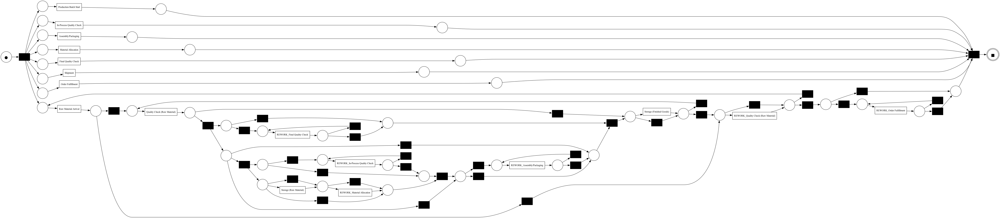

# Gigafactory Battery Production Process Mining

[](https://www.python.org/)
[](LICENSE)
[](https://github.com/mammykins/giga-factory/stargazers)
[](https://github.com/mammykins/giga-factory/commits/main)
[](https://github.com/mammykins/giga-factory)

This project provides a framework for analyzing and understanding the production process of a gigafactory that manufactures a product at scale (e.g. batteries). It combines **synthetic data generation** with **process mining techniques** to identify bottlenecks, rework loops, and potential areas for optimization.  

---

## Who Is This For?
This project is intended for:
- **Data scientists** exploring process mining methods with synthetic data.
- **Manufacturing engineers** who want to experiment with analysis techniques before applying them to real gigafactory data.
- **Students and researchers** learning about process discovery and event log analysis.

---

## Usage Scenarios
- **Demo Mode (Synthetic Data):**
  Run the included scripts to generate a synthetic event log and perform process mining analysis. This is useful for learning and experimentation.
- **Real Data Mode:**
  Replace the synthetic CSV with actual production event data (see *Next Steps for Real-World Application*).

---

## Core Features
1. **Synthetic Data Generation:** Creates a sorta-realistic event log simulating a battery production process, including various stages, durations, potential rework loops, and batch-specific attributes.
2. **Process Discovery:** Uses the `pm4py` library to discover a process model (Petri Net) from the event log, representing the actual flow of activities.
3. **Process Analysis & Insights:** Provides metrics such as:
   - Most frequent activities
   - Start and end activities
   - Bottleneck analysis (average durations)
   - Rework loop detection
   - Conformance checking (fitness, precision, robustness)
   - Correlation analysis between batch size and process outcomes

---

## Technologies Used
- **Python** – core programming language
- **Pandas / NumPy** – data handling and synthetic generation
- **PM4Py** – process mining algorithms and visualization
- **Matplotlib** – process model visualization

---

## Setup and Installation
1. **Clone the repository** (or download the files):
   ```bash
   git clone https://github.com/your-username/gigafactory-process-mining.git
   cd gigafactory-process-mining


2. **Create a virtual environment** (recommended):

   ```bash
   python -m venv venv
   # On Windows:
   .\venv\Scripts\activate
   # On macOS/Linux:
   source venv/bin/activate
   ```

3. **Install dependencies:**

   ```bash
   pip install -r requirements.txt
   ```

4. **Install Graphviz (for visualizations):**

   * macOS: `brew install graphviz`
   * Ubuntu/Debian: `sudo apt-get install graphviz`
   * Windows: Download from [graphviz.org](https://graphviz.org/download/) and add to PATH.

---

## Project Structure

```
.
├── requirements.txt                # Python dependencies
├── battery_production_miner.py     # Generates synthetic event log
├── process_mining_analysis.py      # Performs process mining analysis on event logs
├── battery_production_event_log.csv # Example synthetic data (generated)
├── discovered_process_model.png    # Example discovered process visualization (generated)
└── README.md                       # Documentation
```

---

## How to Run

1. Ensure all dependencies are installed.
2. Run the scripts:

   ```bash
   python battery_production_miner.py
   python process_mining_analysis.py
   ```

   These will:

   * Generate synthetic battery production event log data
   * Save it to `battery_production_event_log.csv`
   * Discover a process model using the Inductive Miner
   * Save the process model visualization to `discovered_process_model.png`
   * Print insights to the console

---

## Example Output

**Console Output (excerpt):**

```
Most frequent activities:
  Assembly → Final Test → Packaging

Start activities: Material Received
End activities: Shipping

Average activity durations (minutes):
  Assembly: 14.2
  Final Test: 30.5  <-- potential bottleneck
```

**Example Process Model Visualization:**



---

## Example Insights

* **Bottlenecks:** Longest average activity durations highlight efficiency constraints.
* **Rework Loops:** High rework rates suggest quality or process control issues.
* **Batch Size Impact:** Larger batches may correlate with increased rework or delays.
* **Conformance:** Metrics show how closely execution matches the expected process.

---

## Next Steps for Real-World Application

1. **Data Collection:** Extract real event data from MES/SCADA/ERP systems. Required fields:

   * Case ID (Batch ID / Lot Number)
   * Activity Name (e.g., "Assembly," "QC")
   * Timestamp
   * Optional: Resource, Batch Size, Quality Results

2. **Data Preprocessing:** Clean and format data into the `pm4py` event log structure.

3. **Analysis:** Apply discovery, bottleneck analysis, and conformance checking to real logs.

4. **Actionable Improvements:** Use findings to improve scheduling, automation, and quality control.

---

## Contributing and Extensions

You can extend this project by:

* Trying alternative process mining algorithms from `pm4py`
* Modifying the synthetic data generator (e.g., simulate breakdowns or quality drift)
* Adding visualizations (e.g., rework heatmaps, lead-time distributions)
* Extending the analysis

Contributions and pull requests are welcome!

---

## License

MIT License – feel free to use, adapt, and extend.
